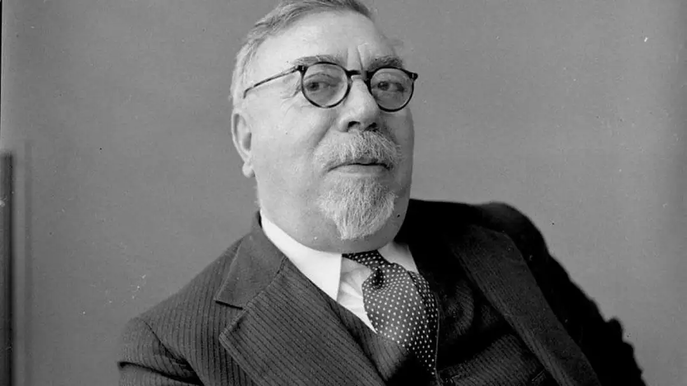
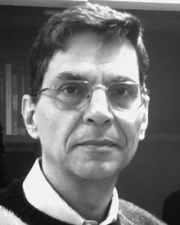
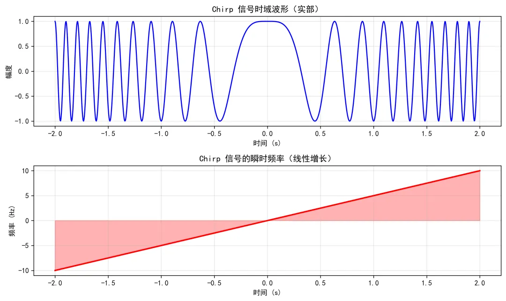
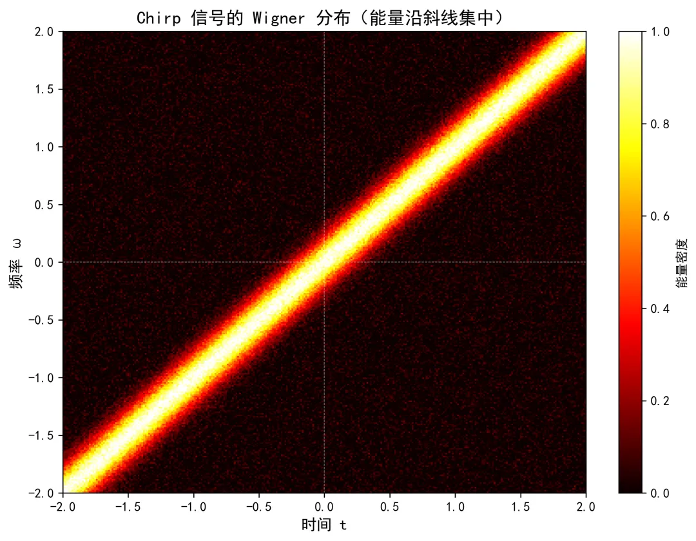
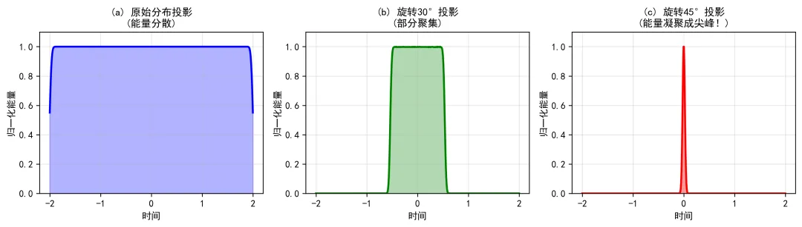
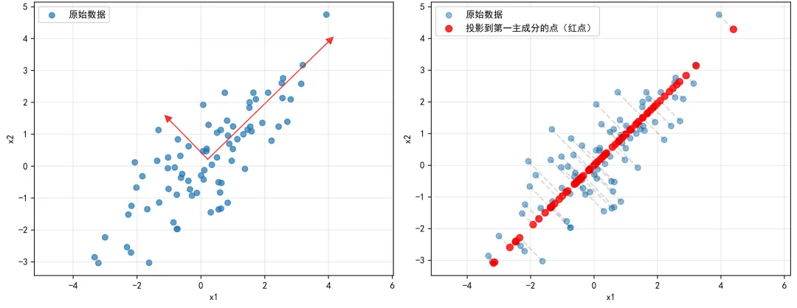

# 一、引言：傅里叶变换的“旋转”视角

在前面的文章中，我们见识了傅里叶变换的强大：它能把时域信号分解成频域的正弦波，告诉我们“信号里有哪些频率”。这个变换的本质，可以看作在时频平面上**旋转 90°**：时域 → 频域。

那么问题来了：**为什么一定是 90°？能不能旋转任意角度？**

这个问题的答案，就是**分数阶傅里叶变换**（Fractional Fourier Transform, FRFT）。

标准傅里叶变换将信号从时域完全“拧”到频域，时间信息彻底丢失。如果我们只旋转 45°，会得到一个**时频混合域**——信号既保留了一定的时间信息，又保留了一定的频率信息，可以同时看到“何时”和“什么频率”。

这正是分数阶傅里叶变换的魅力所在。它的阶数 $ p $ 控制着旋转角度 $ \phi = p \cdot \pi/2 $。

| 阶数 $ p $ | 角度 $ \phi $ | 变换类型 |
| :--- | :--- | :--- |
| 0 | 0° | 恒等变换（时域） |
| 1 | 90° | 标准傅里叶变换（频域） |
| 0.5 | 45° | 时频混合域 |
| -1 | -90° | 傅里叶逆变换 |

分数阶傅里叶变换因此被称为**傅里叶变换的统一数学框架**。它不仅架起了时域和频域的桥梁，还连接了Wigner分布、小波变换、短时傅里叶变换等多种时频分析工具。

分数阶傅里叶变换的应用已遍布信号处理的各个角落，它特别擅长处理**线性调频（Linear Frequency Modulation, LFM）信号（即 Chirp 信号）**——一种频率随时间线性变化的信号，在雷达、声呐、通信、生物医学等领域中频繁出现。下文将详细解释其中的原理。

# 二、历史的转折：跨越七十年的思想接力

分数阶傅里叶变换并非一蹴而就，而是一条跨越近七十年的思想接力。

## 2.1 早期萌芽：Wiener、Condon 与 Kober

近代意义上的连续分数阶傅里叶变换概念，通常认为始于1980年Namias的工作。但其数学思想的萌芽，可以追溯到20世纪20年代Wiener等人对傅里叶变换特征值问题的研究。美国数学家**诺伯特·维纳**（Norbert Wiener）在研究傅里叶变换的特征函数时发现，傅里叶变换的特征函数是埃尔米特多项式乘以 $ e^{-t^2} $，其对应的特征值是 $(-i)^n$。1929 年，他提出将特征值推广为 $ e^{-i n \alpha} $，这被认为是与分数阶傅里叶变换有关的最早工作。

  
  
诺伯特·维纳（Norbert Wiener，1894-1964）

1937 年，美国物理学家**爱德华·康登**（Edward Condon，1902-1974）独立研究了同一问题，从量子力学的角度推导了分数阶傅里叶变换的基本定义。

1939 年，德国数学家**赫尔曼·科伯**（Hermann Kober，1888-1973）提出了另一种形式的定义，将分数阶傅里叶变换视为傅里叶变换的“分数次幂”。1956 年，**吉南**（Guinand）引用科伯的理论讨论了整数阶与分数阶傅里叶变换的关系。

这些早期工作在很长一段时间里都只是纯数学的探索，没有进入工程应用。但它们为后来的研究奠定了数学基础。

## 2.2 奈米亚斯：早逝的奠基者

1980 年，一位年轻的印度数学家**维基特·奈米亚斯**（Victor Namias，1940-1985）从特征值和特征函数的角度，以纯数学的方式系统提出了分数阶傅里叶变换的概念。他将其应用于求解微分方程，发表了多篇论文。然而，Namias英年早逝，年仅 45 岁。他的工作在发表后并未立即引起广泛关注，被埋没了十余年。

1987 年，**麦克布莱德**（McBride）和**科尔**（Kerr）用积分形式为分数阶傅里叶变换给出了更严格的数学定义，为后续从光学角度的突破奠定了基础。

## 2.3 门德洛维奇与奥兹阿克塔斯：光学突破

1993 年，以色列特拉维夫大学的**大卫·门德洛维奇**（David Mendlovic）和土耳其比尔肯特大学的**哈尔顿·M·奥扎克塔斯**（Haldun M. Ozaktas）给出了分数阶傅里叶变换的**光学实现**。他们发现：**光在渐变折射率介质中传播时，光场分布恰好对应输入信号的分数阶傅里叶变换，变换阶数由介质长度决定**。

  
  
大卫·门德洛维奇（David Mendlovic，1962-）

  
  
哈尔顿·M·奥扎克塔斯（Haldun M. Ozaktas，1966-）

这一发现是革命性的。在此之前，分数阶傅里叶变换只是纸上的公式；现在，它可以用光学设备直接实现。分数阶傅里叶变换从此进入了光学信息处理领域。

## 2.4 阿尔梅达：时频平面的旋转

尽管在光学领域找到了物理实现，分数阶傅里叶变换在信号处理领域仍然迟迟未能得到应有的重视。原因在于：它缺乏一个直观的**信号处理解释**。

  
  
路易斯·阿尔梅达（Luís B. Almeida）

1994 年，葡萄牙里斯本大学的**路易斯·阿尔梅达**（Luís B. Almeida）补上了这块拼图。他在一篇题为《The fractional Fourier transform and time-frequency representations》的论文中指出：

> **分数阶傅里叶变换的本质，是在时频平面上旋转信号。**

这一解释极具穿透力。工程师们不必再面对复杂的积分核，只需要记住一句话就能理解 FRFT：**它把时频平面旋转了一个角度**。阿尔梅达还系统梳理了 FRFT 与 Wigner 分布、模糊函数、短时傅里叶变换等主流时频分析工具的关系，极大降低了 FRFT 的使用门槛。

阿尔梅达的“时频旋转”解释，将 FRFT 从一个抽象的数学工具变成了一种直观的信号分析视角。从此，工程师们可以在脑海中“旋转”信号，寻找它最集中的角度——这正是 FRFT 在信号处理中得以广泛应用的思想起点。

## 2.5 奥扎克塔斯：快速算法与信号处理革命

光学实现和时频解释齐备后，FRFT 进入信号处理领域还差最后一块拼图——**快速离散算法**。1996 年，奥扎克塔斯与合作者提出了一种计算复杂度与快速傅里叶变换（FFT）相当的离散算法。

这意味着：计算机可以用与 FFT 同样的效率来计算分数阶傅里叶变换。FRFT 终于可以从光学实验室走进数字信号处理的工程应用。

此后，FRFT 在雷达、声呐、通信、图像处理、信息安全等领域迅速开花结果。从 1929 年维纳的思辨，到 1980 年奈米亚斯的奠基，再到 1990 年代的光学实现、时频解释和快速算法——FRFT 用了近七十年的时间，完成了从纯粹数学到工程应用的蜕变。

# 三、分数阶傅里叶变换的数学定义

## 3.1 积分形式

分数阶傅里叶变换的积分定义为：

$$
\mathcal{F}^p[f](u) = \int_{-\infty}^{\infty} f(t) K_p(t,u) \, dt
$$

其中：
- $ t $ 是**时域变量**（时间），对应原信号 $ f(t) $ 的自变量
- $ u $ 是**分数阶傅里叶域变量**，对应变换后的自变量。它不是纯粹的时间或频率，而是时频平面上旋转角度 $ \phi = p\pi/2 $ 后的新坐标
- $ p $ 是变换阶数（实数）

核函数 $ K_p(t,u) $ 的表达式为：

$$
K_p(t,u) = 
\begin{cases}
\sqrt{\frac{1 - i \cot \phi}{2\pi}} \exp\left(i \frac{t^2 + u^2}{2} \cot \phi - i t u \csc \phi\right), & \phi \neq n\pi \\
\delta(t - u), & \phi = 2n\pi \\
\delta(t + u), & \phi = (2n+1)\pi
\end{cases}
$$

其中 $ \phi = p \pi / 2 $ 是旋转角度，$ n $ 为整数。

当 $ p = 1 $（$ \phi = \pi/2 $）时，核函数退化为标准傅里叶变换的核 $ e^{-itu} $，此时 $ u $ 成为频率变量 $ \omega $：

$$
K_1(t,u) = \frac{1}{\sqrt{2\pi}} e^{-itu}
$$

当 $ p = 0 $（$ \phi = 0 $）时，核函数退化为 $ \delta(t-u) $，此时 $ u $ 成为时间变量，变换结果就是原信号本身（恒等变换）。

## 3.2 本征函数

回顾标准傅里叶变换的本征函数是 **Hermite-Gaussian 函数**（埃尔米特-高斯函数）。FRFT 作为傅里叶变换的推广，其本征函数同样是 Hermite-Gaussian 函数，只是特征值被推广为 $ e^{-i n \phi} $。这正是 1929 年 Wiener 最早做的推广工作。

> **注意区分**：Hermite-Gaussian 函数是 FRFT 的**本征函数**（数学基），而 Chirp 信号是在特定阶数下 FRFT 会“凝聚”成尖峰的一类信号，后者是能量集中特性的体现，**不是本征函数意义上的性质**。两者服务于不同的目的：Hermite-Gaussian 用于理论构建，Chirp 信号用于工程检测。

## 3.3 分数阶傅里叶变换的基本性质

分数阶傅里叶变换具有以下重要性质：

- **阶数可加性**：$\mathcal{F}^p \mathcal{F}^q = \mathcal{F}^{p+q}$。做两次 FRFT，等价于做一次阶数之和的 FRFT。特别地，四次变换回到原函数：$\mathcal{F}^4 = \mathcal{I}$。

- **酉性**：分数阶傅里叶变换是酉变换，保持信号的能量（或 $ L_2 $ 范数）不变。

- **逆变换**：$\mathcal{F}^{-p}$，即旋转反向角度，就是把信号转回原坐标系。

- **旋转角度周期性**：$\mathcal{F}^{p + 4} = \mathcal{F}^p$，周期为 4，对应角度周期 $ 2\pi $。

这组性质与角动量算符的旋转群结构有深层对应。FRFT 的群论背景来源于**海森堡群**（Heisenberg group）——这就是它和量子力学、光学中相空间理论之间的数学同构性。

# 四、时频平面上的旋转：Wigner 分布视角

## 4.1 什么是 Wigner 分布？

信号分析中有两个最基本的物理量：**时间 $ t $** 和 **频率 $ \omega $**。把时间和频率作为坐标轴，就构成了**时频平面**。为了同时描述信号在时间和频率上的能量分布，Wigner 分布应运而生。

对于一个信号 $ f(t) $，其 Wigner 分布定义为：

$$
W_f(t, \omega) = \int_{-\infty}^{\infty} f\left(t + \frac{\tau}{2}\right) \cdot f^*\left(t - \frac{\tau}{2}\right) \cdot e^{-i \omega \tau} \, d\tau
$$

这个公式的含义是：
- 固定时间 $ t $，考察信号在 $ t + \tau/2 $ 和 $ t - \tau/2 $ 两个对称点上的相关性
- 乘以傅里叶核 $ e^{-i\omega\tau} $，将这种相关性从时间差域转换到频率域
- 对所有时间差 $ \tau $ 积分，得到该时刻的频率能量分布

因此，Wigner 分布可以理解为：**在每个时刻 $ t $，计算信号的对称自相关，再对其做傅里叶变换**。

## 4.2 什么是 Chirp 信号？

**Chirp 信号**（线性调频信号，也叫**啁啾信号**）是一种频率随时间线性变化的信号。其一般形式为：

$$
s(t) = e^{i 2\pi (f_0 t + \frac{1}{2} k t^2)}
$$

其中 $ f_0 $ 是起始频率，$ k $ 是**调频率**（频率变化的速率，单位：Hz/s）。瞬时频率为：

$$
f(t) = f_0 + k t
$$

当 $ k > 0 $ 时，频率随时间增加（“**上啁啾**”）；当 $ k < 0 $ 时，频率随时间减小（“**下啁啾**”）。

  
  
图1：Chirp 信号的时域波形（上）与瞬时频率（下）。频率随时间线性增加，呈现“上啁啾”特性。

Chirp 信号在自然界和工程中广泛存在：
- **雷达与声呐**：脉冲压缩雷达发射的波形就是 Chirp 信号
- **生物声学**：蝙蝠和海豚的回声定位信号是 Chirp
- **通信**：LoRa 物联网通信技术使用 Chirp 扩频
- **物理实验**：牛顿环条纹图是二维 Chirp 信号

## 4.3 Chirp 信号的 Wigner 分布

将 Chirp 信号 $ f(t) = e^{i \beta t^2} $（其中 $ \beta = \pi k $）代入 Wigner 分布定义，经过推导可得：

$$
W_f(t, \omega) = 2\pi \cdot \delta(\omega - k t)
$$

**结论**：Chirp 信号的 Wigner 分布能量严格集中在直线 $ \omega = k t $ 上，偏离这条直线的任何位置能量为零。这是一条**冲激线**——能量沿着一条无限细的斜线分布。

为了直观理解“能量沿斜线分布”，考虑一个具体的 Chirp 信号 $ s(t) = e^{i \pi t^2} $，其参数 $ k = 1 $，瞬时频率 $ f(t) = t $。在时频平面上，它的能量沿 45° 斜线分布。

  
  
图2：Chirp 信号 $ e^{i\pi t^2} $ 的 Wigner 分布模拟。能量严格集中在 45° 斜线上，是一条“冲激线”。

如果对这个信号做标准傅里叶变换，能量会被分散在整个频域，看不出明显的规律。这正是标准傅里叶变换处理非平稳信号时的局限。

在分数阶傅里叶变换下，选择合适的阶数 $ p = 0.5 $（即旋转角度 $ \phi = 45° $），可以在变换域中看到一个尖峰。这是因为旋转后，原本沿斜线分布的能量被“投影”到了一个极窄的区域——能量从分散状态突然凝聚。

  
  
图3：FRFT 对 Chirp 信号的能量凝聚效应。(a) 原始分布投影，能量分散；(b) 旋转30°投影，部分聚集；(c) 旋转45°投影（最佳角度），能量凝聚成尖锐的峰。

这便是分数阶傅里叶变换最独特的魅力：**你不能改变信号的本质，但可以通过旋转观察角度，让它的能量看起来更集中，从而更容易被检测、分离和识别**。

## 4.4 FRFT 与 Wigner 分布：旋转与重采样

FRFT 与 Wigner 分布的核心关系是：

$$
W_{\mathcal{F}^p f}(t, \omega) = W_f(t\cos\phi - \omega\sin\phi,\; t\sin\phi + \omega\cos\phi), \quad \phi = p\pi/2
$$

这个公式揭示了 FRFT 作用于 Wigner 分布时的本质操作：**坐标旋转 + 网格重采样**。

具体来说：

1. **坐标旋转**：原时频平面上的坐标轴被旋转了角度 $ \phi $。

2. **网格重采样**：新信号的 Wigner 分布 $ W_{\mathcal{F}^p f} $ 是在新坐标网格上重新采样的结果。新图中每一个采样点 $ (t, \omega) $ 的值，等于原图中**旋转后对应位置**的数值。

关键点在于：**重采样会导致能量在新坐标系下的分布方式发生根本变化**。

- 原图中能量沿一条斜线连续分布
- 在新坐标系下，这条斜线保持连续，但新图是在一个离散的网格上采样的
- 当斜线与新坐标轴对齐时（即旋转角度使得斜线变成竖直线），原本连续分布的能量会“挤”到少数几个新采样点上
- 这些采样点累积了来自原图大量点的能量贡献，从而在新图中形成一个**尖锐的能量峰**

**这不是原 Wigner 分布中已经存在的尖峰，而是通过旋转加重采样重新组织能量后新产生的。**

因此，FRFT 对 Wigner 分布的作用不能简单理解为“坐标旋转”，而是“坐标旋转 + 网格重采样 + 能量重组”。正是这种能量重组，使得 Chirp 信号在新坐标系下呈现出尖峰，从而被检测和识别。

# 五、Chirp 信号与 FRFT 的深层关系

## 5.1 为什么 FRFT 擅长处理 Chirp 信号？

从第四章的讨论可知，Chirp 信号在时频平面上的能量分布在一条斜线上，斜率由调频率 $ k $ 决定。FRFT 通过旋转并重采样 Wigner 分布，可以使这条斜线与新坐标轴对齐，从而将 Chirp 信号“凝聚”成一个尖峰。

具体来说，对于调频率为 $ k $ 的 Chirp 信号，存在一个特定的阶数：

$$
p = \frac{2}{\pi} \arctan(k) \quad \text{或等价地} \quad \tan \phi = k
$$

使得在该阶数的 FRFT 下，Chirp 信号在新 Wigner 分布中变为一个尖峰。这一性质使得 FRFT 成为检测和估计 Chirp 信号参数的有力工具：你只需要在不同的阶数下计算 FRFT，观察哪里出现尖峰，就能确定 Chirp 信号的调频率和其他参数。

## 5.2 FRFT 与 PCA 的类比：本质区别

在**主成分分析**（PCA）中，我们通过旋转坐标轴，使数据在新坐标下的投影方差最大，从而找到数据的“主方向”。**PCA 不改变数据本身**，只是换了一个角度看同一个数据点集。

下图展示了 PCA 的操作过程：

  
  
图3：PCA示意图。左图：原始数据分布及两个主成分方向（红色箭头）；右图：数据投影到第一主成分后的结果（红点）与原始数据的连线。

FRFT 对 Chirp 信号所做的，表面上类似——在时频平面上寻找一个最佳旋转角度，使能量在某坐标轴上最集中。但两者也有本质区别：**PCA 是旋转视角，数据不变；FRFT 是旋转视角 + 重采样，能量分布被重新组织，产生新的尖峰。**用一个直观的比喻来理解：

> - **PCA**：就像对一座固定的山体模型进行 3D 扫描，然后旋转观察角度，找到山体最“宽”的方向（主成分方向）。**山体本身不变，变的是视角。**
> - **FRFT**：不仅旋转观察角度，还在**对山体本身进行“重采样”和“重构”**。随着旋转角度的变化，原来的斜坡可能隆起为尖峰，原来的尖峰可能夷为平地。**山体的形态在变化，不仅仅是视角在变化。**

PCA 与 FRFT 的本质区别总结如下：

| 维度 | PCA（主成分分析） | FRFT（分数阶傅里叶变换） |
| :--- | :--- | :--- |
| **核心操作** | 旋转坐标轴 + 正交投影 | 时频平面旋转 + 网格重采样 + 能量重组 |
| **变换本质** | 纯线性代数操作 | 分数阶变换核，涉及重采样/插值 |
| **数据/信号变化** | 坐标数值改变，但数据点本身的相对关系不变（仅投影） | 能量分布被重新组织，可产生原图中不存在的尖峰 |
| **离散实现** | 直接计算，无需插值 | 离散实现时通常需要重采样/插值才能保持能量守恒与可逆性 |
| **目标** | 寻找方差最大的投影方向（降维） | 寻找能量最集中的旋转角度（检测/参数估计） |

> - **PCA**：通过旋转坐标轴使投影方差最大，数据点坐标数值改变，但这是**线性正交投影**，不涉及信号重采样或插值操作。
> - **FRFT**：在时频平面旋转任意角度，离散实现时通常需要**重采样/插值**才能保持能量守恒与可逆性。

简言之，**PCA 是纯线性代数操作（正交投影）；FRFT 是一种分数阶变换核，离散化时依赖非平凡的重采样过程。**

因此，FRFT 不仅仅是一个“分析工具”，它实际上是在**构造一个对 Chirp 信号最有利的观察坐标系**，在这个坐标系下，Chirp 信号的能量被“凝聚”成尖峰，从而极大简化检测和参数估计。

# 六、分数阶傅里叶变换的特点

分数阶傅里叶变换之所以受到广泛关注，是因为它具有传统傅里叶变换所不具备的独特性质。

## （一）自由参量：从时域到频域的连续过渡

分数阶傅里叶变换具有一个自由参量——变换阶数 $ p $。随着 $ p $ 从 0 连续变化到 1，FRFT 可以提供信号从时域逐步变化到频域的所有特征。这为信号的表征、分析和处理提供了更广阔的视角。

## （二）Chirp 基分解与能量凝聚

如前所述，FRFT 通过旋转并重采样观察角度，将 Chirp 信号“凝聚”成尖峰。这一性质使得 FRFT 天然适配线性调频信号的处理。

## （三）无交叉项的时频表示

分数阶傅里叶变换本质上是一种**时频变换**。与常用的二次型时频分布（如 Wigner-Ville 分布）不同，FRFT 利用**单一变量**来表示时频信息，**没有交叉项困扰**。因此，在处理具有加性噪声的多分量信号时，FRFT 往往比 WVD 更具优势。

## （四）快速离散算法

FRFT 具有成熟的快速离散算法，其计算复杂度与 FFT 相当，为 $ O(N \log N) $。快速算法的存在，意味着 FRFT 可以嵌入到实时系统中，成为雷达、通信、图像处理等领域的实用工具。（详见第七章）

# 七、快速离散算法：让 FRFT 可计算

## 7.1 为什么需要快速算法？

直接按积分定义计算 FRFT 的复杂度是 $ O(N^2) $（与 DFT 类似），对大规模信号不现实。要使 FRFT 进入实时工程应用，必须有快速算法。

## 7.2 算法的核心：核函数的“裂开”

奥扎克塔斯快速算法的巧妙之处在于：把 FRFT 的核函数“拆解”成三个因子的乘积。

$$
K_p(t,u) = C_\phi \cdot e^{i\frac{t^2}{2}\cot\phi} \cdot e^{-i t u \csc\phi} \cdot e^{i\frac{u^2}{2}\cot\phi}
$$

这是一个了不起的分解：
- **左边** $ e^{i\frac{t^2}{2}\cot\phi} $：只与 $ t $ 有关（Chirp 乘法）
- **中间** $ e^{-i t u \csc\phi} $：是标准傅里叶变换的核（仅差一个因子）
- **右边** $ e^{i\frac{u^2}{2}\cot\phi} $：只与 $ u $ 有关（Chirp 乘法）

## 7.3 算法步骤

由此得到 FRFT 的快速算法：

| 步骤 | 操作 | 说明 | 复杂度 |
| :--- | :--- | :--- | :--- |
| **1** | $ g(t) = f(t) \cdot e^{i\frac{t^2}{2}\cot\phi} $ | 时域乘 Chirp | $ O(N) $ |
| **2** | $ G(w) = \text{FFT}[g(t)] $ | 标准快速傅里叶变换 | $ O(N \log N) $ |
| **3** | \(\mathcal{F}^p\[f\](u) = C_\phi \cdot e^{i\frac{u^2}{2}\cot\phi} \cdot G(u \csc\phi)\) | 频域乘 Chirp + 伸缩 | \( O(N) \) |

第一步和第三步的 Chirp 乘法是对 $ N $ 个采样点逐点相乘，计算复杂度为 $ O(N) $，非常容易实现。整个算法的计算量由中间的 FFT 主导，因此总复杂度为 $ O(N \log N) $，与标准 FFT 处于同一量级。

## 7.4 几何解释

这个算法的几何意义非常清晰：

- **第一步（乘 Chirp）**：在**原始时频平面**上做一次**垂直剪切**
- **第二步（FFT）**：在时频平面上做一次 **90° 旋转**
- **第三步（乘 Chirp）**：在**旋转后的新坐标系**下，再做一次**垂直剪切**

三次操作合起来，恰好等于时频平面的一次**任意角度旋转**（包括重采样）。因此，FRFT 能通过“两次 Chirp 乘法 + 一次 FFT”快速实现。

# 八、分数阶傅里叶变换与标准傅里叶变换的关系

| 维度 | 标准傅里叶变换 | 分数阶傅里叶变换 |
| :--- | :--- | :--- |
| **角度** | 固定 90° | 任意角度 $ \phi $ |
| **时频信息** | 全消失（频域） | 部分保留在混合域 |
| **基函数** | 正弦波 | **线性调频函数（Chirp）** |
| **适用信号** | 平稳信号 | **非平稳/线性调频信号** |
| **对 Chirp 信号的表现** | 能量分散 | 在最佳角度下凝聚成尖峰 |

FRFT 不是取代傅里叶变换，而是提供一个**可调节的分析视角**。你可以根据信号的特性选择最合适的阶数，使信号在变换域中能量最集中、结构最简单。

# 九、分数阶傅里叶变换改变了什么

## 1. 雷达与声呐

雷达发射的是线性调频脉冲信号。回波信号同样是 Chirp，只是延迟和多普勒频移不同。分数阶傅里叶变换可以在最佳阶数下将 Chirp 信号“聚焦”成尖峰，从而极大提高信噪比，实现更精准的距离与速度估计。这在动目标检测、合成孔径雷达成像等领域已有广泛应用。

## 2. 通信系统

**Chirp 扩频通信**（如 LoRa 技术）利用 Chirp 信号传输信息。接收端使用 FRFT 可以简化阶数搜索和匹配滤波，降低功耗和计算复杂度。此外，基于 FRFT 的多载波系统（FRFT-OFDM）在快时变信道中表现出比传统 OFDM 更强的鲁棒性。

## 3. 生物医学信号处理

心电图（ECG）、脑电图（EEG）中的信号常表现为非平稳的 Chirp 状模式。FRFT 能更精细地刻画这些信号在“时频域”的演化规律，辅助医生进行癫痫监测、麻醉深度评估等诊断。

## 4. 光学与图像处理

光波在梯度折射率介质中传播时，光场的演化在数学上等价于 FRFT。它可以用于设计新型变焦透镜、分数阶光学相关器。在图像加密和水印中，FRFT 可作为额外的“密钥维度”，提高安全等级。

## 5. 量子力学

量子态在相空间中的演化可用 FRFT 统一描述，它和 Wigner 分布函数关系密切，提供了另一种理解测不准原理的视角。

# 十、结语：坐标旋转与能量重组

标准傅里叶变换把时域旋转 90° 送到频域，信息从一端彻底消失。小波变换通过伸缩窗口实现时频分辨率自适应，但其时频网格始终是轴对齐的矩形（只能沿时间轴和频率轴划分）。FRFT 则更进一步，它的时频分区是**任意旋转的斜线网格**，使分析方向与信号内部结构对齐。

不仅如此，FRFT 在旋转坐标轴的同时，还在新坐标系下**重新采样**和**重组能量**。当旋转到合适角度时，原本沿斜线分布的 Chirp 能量被“挤压”成一个尖峰——这不是原图中已有的结构，而是通过重采样新产生的。

因此，FRFT 不仅是“旋转视角”，更是一种**能量重组的操作**。它让我们能够根据信号的内部结构，主动构造一个最有利的观察坐标系，使隐藏的模式显现出来。从雷达动目标检测到 LoRa 物联网通信，从医学诊断到光学加密，FRFT 正在越来越多的工程领域中发挥着不可替代的作用。

在 Chirp 信号的世界里，它是最自然的语言。当你通过旋转和重采样找到与信号内在结构一致的观察角度时，复杂就还原为简单。

# 参考文献

1. Wiener, N. (1929). Hermitian polynomials and Fourier analysis. *Journal of Mathematics and Physics*, 8(1-4), 70-73.
2. Condon, E. U. (1937). Immersion of the Fourier transform in a continuous group of functional transformations. *Proceedings of the National Academy of Sciences*, 23(3), 158-164.
3. Kober, H. (1939). On fractional integrals and the Fourier transform. *Quarterly Journal of Mathematics*, (1), 186-212.
4. Namias, V. (1980). The fractional order Fourier transform and its application to quantum mechanics. *Journal of the Institute of Mathematics and its Applications*, 25(3), 241-265.
5. McBride, A. C., & Kerr, F. H. (1987). On Namias's fractional Fourier transforms. *IMA Journal of Applied Mathematics*, 39(2), 159-175.
6. Mendlovic, D., & Ozaktas, H. M. (1993). Fractional Fourier transforms and their optical implementation. *Journal of the Optical Society of America A*, 10(12), 2522-2531.
7. Almeida, L. B. (1994). The fractional Fourier transform and time-frequency representations. *IEEE Transactions on Signal Processing*, 42(11), 3084-3091.
8. Ozaktas, H. M., Arikan, O., Kutay, M. A., & Bozdagi, G. (1996). Digital computation of the fractional Fourier transform. *IEEE Transactions on Signal Processing*, 44(9), 2141-2150.
9. Lohmann, A. W. (1993). Image rotation, Wigner rotation, and the fractional Fourier transform. *Journal of the Optical Society of America A*, 10(10), 2181-2186.
10. Flandrin, P., & Martin, W. (1997). The Wigner-Ville spectrum of nonstationary random signals. *In The Wigner Distribution: Theory and Applications in Signal Processing*, 211-267.
11. 陶然, 马金铭, 邓兵, 王越. (2022). *分数阶傅里叶变换及其应用* (第2版). 清华大学出版社.